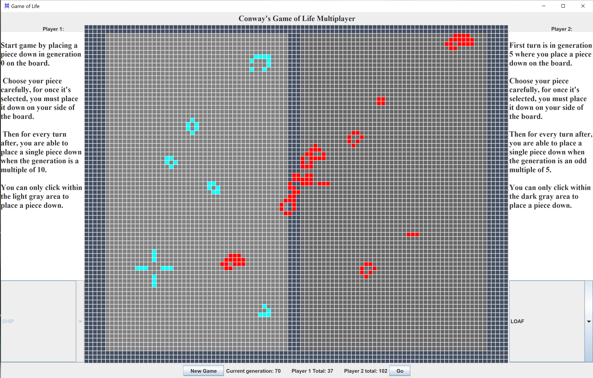

###<u>Conway's Game of Life Multiplayer</u>

A multiplayer game based on Conway's Game of Life. Each player
has 75 turns where he or she places a piece down on the board during 
his or her turn. After generation 150, the players cannot put 
anymore pieces down, and they watch their pieces interact with
one another until generation 500. At that point, a message is 
displayed that says who the winner is and how many cells are for
player 1 and how many are for player 2.

Download executable [jar file](https://github.com/jkomendant/ConwaysGameOfLifeMultiplayer/blob/main/build/libs/ConwaysGameOfLifeMultiplayer-1.0-SNAPSHOT.jar).

